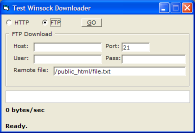

<div align="center">

## Ultimate Winsock Downloader \(HTTP, FTP, Files &gt; 4GB\)


</div>

### Description

v1.0.0 (BETA!!) A UserControl that downloads files &gt; 4GB via HTTP/FTP. Support for redirects (and MaxRedirects property), custom UserAgent, etc. This is not supposed to be a complete implementation of the HTTP or FTP protocols! However, just enough to make it work reliably (I hope!). If you have any bugs please let me know and I will fix them. Next version I will try to support Transfer-Encoding: chunked for some HTML files. Official thread can be found here: http://www.vbforums.com/showthread.php?goto=newpost&amp;t=514329
 
### More Info
 


<span>             |<span>
---                |---
**Submitted On**   |2008-03-19 21:10:32
**By**             |[vEmployer](https://github.com/Planet-Source-Code/PSCIndex/blob/master/ByAuthor/vemployer.md)
**Level**          |Intermediate
**User Rating**    |4.2 (21 globes from 5 users)
**Compatibility**  |VB 6\.0
**Category**       |[Custom Controls/ Forms/  Menus](https://github.com/Planet-Source-Code/PSCIndex/blob/master/ByCategory/custom-controls-forms-menus__1-4.md)
**World**          |[Visual Basic](https://github.com/Planet-Source-Code/PSCIndex/blob/master/ByWorld/visual-basic.md)
**Archive File**   |[Ultimate\_W2106713192008\.zip](https://github.com/Planet-Source-Code/vemployer-ultimate-winsock-downloader-http-ftp-files-gt-4gb__1-70299/archive/master.zip)

### API Declarations

```
Private Declare Function GetInputState Lib "user32" () As Long
Private Declare Sub CopyMemory Lib "kernel32" Alias "RtlMoveMemory" (Destination As Any, Source As Any, ByVal Length As Long)
Private Declare Function WriteFile Lib "kernel32" (ByVal hFile As Long, lpBuffer As Any, ByVal nNumberOfBytesToWrite As Long, lpNumberOfBytesWritten As Long, ByVal lpOverlapped As Any) As Long
Private Declare Function CreateFile Lib "kernel32" Alias "CreateFileA" (ByVal lpFileName As String, ByVal dwDesiredAccess As Long, ByVal dwShareMode As Long, ByVal lpSecurityAttributes As Any, ByVal dwCreationDisposition As Long, ByVal dwFlagsAndAttributes As Long, ByVal hTemplateFile As Long) As Long
Private Declare Function CloseHandle Lib "kernel32" (ByVal hObject As Long) As Long
Private Declare Function SetFilePointer Lib "kernel32" (ByVal hFile As Long, ByVal lDistanceToMove As Long, lpDistanceToMoveHigh As Long, ByVal dwMoveMethod As Long) As Long
Private Declare Function GetFileSize Lib "kernel32" (ByVal hFile As Long, lpFileSizeHigh As Long) As Long
Private Declare Function OpenFile Lib "kernel32" (ByVal lpFileName As String, lpReOpenBuff As OFSTRUCT, ByVal wStyle As Long) As Long
```


